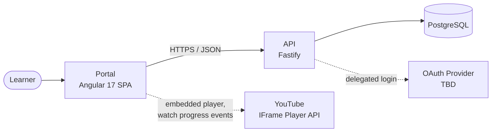
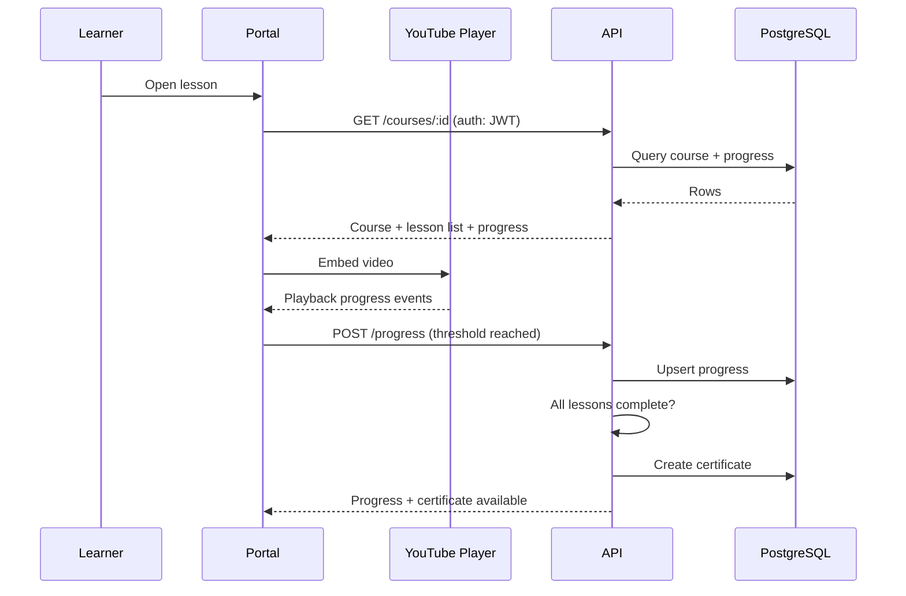
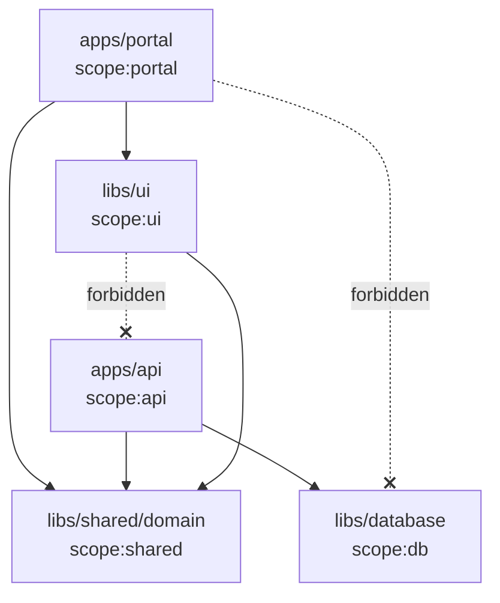

# Architecture — Dude Course

> **Status: scaffold only.** The Nx workspace exists and is configured, but **no applications or
> libraries have been created yet**. Everything in [Section 3](#3-projects) marked _Planned_
> describes the agreed target, not code that exists today.
>
> Product scope lives in [PRD.md](PRD.md). Technology decisions live in [docs/adr](adr/). This
> document explains how the pieces fit together.

## 1. System Context

Dude Course is a portal for sharing courses hosted on YouTube. Learners browse a catalog, enroll in
courses, watch lessons, and receive a certificate on completion.



Two things to note:

- **Video content is never proxied.** Lessons are YouTube videos played through an embedded player;
  the portal only stores a video reference and the resulting watch progress.
- **The portal never talks to the database.** All persistence goes through the API. This is enforced
  by lint rules, not just convention — see [Section 5](#5-dependency-rules).

## 2. Repository Layout

```
apps/                  Deployable applications (none yet)
libs/database/         Prisma schema, client, migrations, and seed tooling
docs/
  PRD.md               Product requirements — source of truth for behavior
  ARCHITECTURE.md      This document
  ONBOARDING.md        How to get productive in this repo
  adr/                 Architecture Decision Records
nx.json                Workspace config, target defaults, generator defaults
compose.yaml           Local PostgreSQL 16
tsconfig.base.json     Path aliases for libraries
.eslintrc.json         Lint config, including module boundary rules
.nvmrc                 Pinned Node version
```

## 3. Projects

| Project       | Path                 | Type                   | Tags                       | Status  |
| ------------- | -------------------- | ---------------------- | -------------------------- | ------- |
| Portal        | `apps/portal`        | Angular 17 SPA         | `type:app`, `scope:portal` | Planned |
| API           | `apps/api`           | Fastify service        | `type:app`, `scope:api`    | Planned |
| UI library    | `libs/ui`            | Buildable Angular lib  | `type:lib`, `scope:ui`     | Planned |
| Database      | `libs/database`      | Prisma schema + client | `type:lib`, `scope:db`     | Active  |
| Shared domain | `libs/shared/domain` | TS types / DTOs        | `type:lib`, `scope:shared` | Planned |

### Portal — `apps/portal`

The learner-facing Angular 17 single-page application, using standalone components. Owns routing,
screens, and view state. Renders shared components from `libs/ui` and calls the API for all data.

### API — `apps/api`

A Fastify service exposing authentication (email/password plus OAuth) and the endpoints backing the
PRD's features: catalog, course detail, enrollment, progress, certificates. It is the **only**
project permitted to reach the database.

### UI library — `libs/ui`

Presentational Angular components shared between the portal and future modules. Buildable via
ng-packagr but **not published** to a registry — it is consumed inside the monorepo through the
`@dudecourse/ui` path alias.

It is deliberately kept free of HTTP and persistence concerns. That restriction is what allows a
future module to reuse it without dragging in this product's API contract.

### Database — `libs/database`

Owns `schema.prisma`, the generated Prisma client, migration history, and seed scripts. The schema
implements the PRD entities as `users`, `auth_accounts`, `courses`, `lessons`, `enrollments`,
`lesson_progress`, and `certificates` — see [ADR 0004](adr/0004-initial-data-model.md). Until an
admin UI exists, the guarded local/HML seed is the catalog content-entry mechanism.

Local development uses PostgreSQL 16 in Docker Compose. HML and PRD use separate managed PostgreSQL
16 instances. Committed migrations are manually promoted through protected GitHub Environments, HML
first and then the exact same revision to PRD. See [DATABASE.md](DATABASE.md) and
[ADR 0003](adr/0003-database-lifecycle.md).

### Shared domain — `libs/shared/domain`

DTOs and entity types used by both the portal and the API, so a change to a contract is a single
edit rather than two that can silently drift. It contains types and pure functions only — no
framework imports.

## 4. Runtime Topology



### Progress tracking

Lessons are marked complete automatically once watch progress crosses a threshold — the portal
observes player events and reports to the API. The exact percentage is
[an open question in the PRD](PRD.md#9-open-questions) and must be a single configured value, not a
number duplicated across the client and server.

The API, not the portal, decides whether a lesson counts as complete. A client that reports progress
cannot be trusted to also decide completion.

### Certificates

Certificate issuance is triggered server-side when the final lesson of an enrollment completes, and
the artifact is a downloadable PDF.

## 5. Dependency Rules

Enforced by `@nx/enforce-module-boundaries` in [.eslintrc.json](../.eslintrc.json). A violating
import fails lint.



| Source tag     | May depend on              |
| -------------- | -------------------------- |
| `scope:portal` | `scope:ui`, `scope:shared` |
| `scope:api`    | `scope:db`, `scope:shared` |
| `scope:ui`     | `scope:shared`             |
| `scope:shared` | `scope:shared` only        |
| `scope:db`     | nothing                    |

Additionally, `type:app` may only depend on `type:lib` — applications never import each other.

These constraints were configured **before** the first project was generated, so the first project
has to satisfy them rather than being retrofitted later. Every new project must declare both a
`type:` and a `scope:` tag; a project with no tags is silently exempt from all of the rules above.

## 6. Version Pinning

This is the most surprising part of the setup, so it is worth stating plainly.

**Angular 17 is a fixed requirement, and it constrains everything else.**

| Pin                 | Value                | Reason                                                                               |
| ------------------- | -------------------- | ------------------------------------------------------------------------------------ |
| Nx                  | `19.8.14` (exact)    | Nx 20+ generates Angular 18/19 only. Nx 19 is the newest line supporting Angular 17. |
| All `@nx/*` plugins | `19.8.14` (exact)    | Mixed plugin versions are the most common cause of generator/migration failures.     |
| Node                | `20.11.0` (`.nvmrc`) | Angular 17 supports Node 18 and 20 only — **not** Node 22+.                          |
| `@angular/core`     | `17.3.12` (exact)    | See below.                                                                           |

### Why `@angular/core` is a dependency of an empty workspace

`@nx/angular@19.8.14` defaults to Angular `~18.2.0`. It only generates Angular 17 projects when it
detects an installed Angular 17, in which case it uses its `angularV17` backward-compatibility map
(`~17.3.0`).

So `@angular/core@17.3.12` is installed up front purely to make that detection succeed. Without it,
the first `nx g @nx/angular:application` would produce an Angular 18 project. The `overrides` block
in `package.json` keeps transitive Angular packages on 17.3.12 to match.

This was verified before any project was created: generating a throwaway app produced
`@angular/cli`, `@angular-devkit/build-angular`, and `@schematics/angular` all at `~17.3.0`.

**Do not remove `@angular/core` from `dependencies`, and do not run `npm update` on Angular
packages,** until the workspace is intentionally migrated off Angular 17.

### Known consequence

Angular 17 is past its LTS window and receives no further patches, including security patches.
`npm audit` reports a non-trivial number of advisories originating from the Angular 17-era
toolchain. These cannot be resolved without upgrading Angular, which the current constraint forbids.
The migration path out is documented in
[ADR 0001](adr/0001-tech-stack.md#migration-path-out-of-angular-17).

## 7. Cross-Cutting Concerns

| Concern    | Approach                                                                                                                     | Status                           |
| ---------- | ---------------------------------------------------------------------------------------------------------------------------- | -------------------------------- |
| AuthN      | Email/password + OAuth, JWT issued by the API                                                                                | Not implemented                  |
| AuthZ      | Learners may only read/modify their own enrollments, progress, certificates ([PRD §7](PRD.md#7-non-functional-requirements)) | Not implemented                  |
| Secrets    | Local `.env`; hosted `DATABASE_URL` values in GitHub Environments. Never committed                                           | Database path active             |
| Testing    | Jest for unit tests, Playwright for e2e                                                                                      | Configured as generator defaults |
| Formatting | Prettier, enforced via `npm run format:check`                                                                                | Active                           |
| CI         | Database checks plus manual HML/PRD migration and HML seed workflows                                                         | Database path active             |

## 8. Decisions

- [ADR 0001 — Tech Stack](adr/0001-tech-stack.md)
- [ADR 0002 — Monorepo Layout](adr/0002-monorepo-layout.md)
- [ADR 0003 — Database Lifecycle and Environments](adr/0003-database-lifecycle.md)
- [ADR 0004 — Initial Data Model](adr/0004-initial-data-model.md)

New architectural decisions belong in a new ADR rather than an edit to this file; this document
describes the current state, while ADRs record why it is that way.
